# Summary
 
Weather stations are the backbone of climate monitoring, providing the daily precipitation and other measurements that
climate modelers and emergency responders rely on. This is especially true
during hurricanes and other extreme precipitation events, when accurate,
up-to-date observations are needed most. Paradoxically, these same storms
are the events most likely to knock stations offline, creating exactly the kind of
data gaps that make severe weather harder to track and respond to.
 
This project analyzes how reliably U.S. weather stations reported data
during six major hurricanes, using records from NOAA's Global Historical
Climatology Network Daily (GHCNd) archive. A Python-based processing
pipeline measures the amount of missing or incomplete data at each station
before and during each storm, and QGIS is used to map where those failures
cluster geographically. The results show that stations near coastlines and
within a storm's direct path fail most often, and that the consequences of
failure depend heavily on how densely a region is monitored: dense urban
networks (such as New York City during Hurricane Sandy) tend to retain
overall coverage even when individual stations go down, while sparse rural
networks (such as parts of the Gulf Coast) can develop large observational
blind spots from just a few failures.
 
# Statement of need
 
Missing data in climate archives has long complicated the study of extreme
weather. Existing approaches to this problem mostly focus on filling
gaps after the fact, for example, using machine learning to generate
synthetic values from historical patterns. These imputation methods are
useful for downstream analysis, but they do not address the underlying
question this project asks: which stations and regions are most likely to
fail in the first place, and why?
 
This software and workflow is built for climate researchers and emergency responders who need a reproducible way to
quantify weather-station reliability during specific storm events, rather
than a generic estimate of missing-data risk. By pairing an automated
Python pipeline (station filtering, missing-data quantification, and
geographic classification) with QGIS-based spatial visualization, the tool
lets a user go from raw GHCNd archive files to per-station reliability
statistics and hurricane-specific outage maps with minimal manual setup.
The target output is intended to support targeted maintenance planning and
network-resilience decisions.
 
# State of the field
 
Prior work on missing values in climate datasets has concentrated on
imputation, such as reconstructing gaps using statistical methods or, more recently,
AI-based approaches trained on historical climate patterns. These methods
are valuable for producing complete records for downstream modeling, but
because they are trained on past conditions, they are poorly suited to
characterizing behavior during the extreme events that cause the gaps in
the first place.
 
Existing GHCNd tooling and NOAA's own distribution infrastructure make the
raw archive available, but do not provide workflow for
event-specific reliability analysis. This would include comparing a station's missing-data
rate before, during, and after a named storm, and relating that rate to
geographic factors such as coastal proximity, urban/rural classification,
and local station density. This project fills that gap by combining
existing, free data sources (GHCNd, U.S. Census Bureau boundary
files) for
storm-by-storm reliability assessment.
 
# Software design
 
The workflow, implemented in Python (using os, io, zipfile, requests, numpy, pandas, matplotlib, geopandas, seaborn, and scipy) and shown in caseStudies.py, downloads and filters the GHCNd station metadata (`ghcnd-stations.txt`) and inventory (`ghcnd-inventory.txt`)
files by latitude/longitude bounding box, date range, and variable type
(e.g., precipitation) for a given event. Then, it stores
each hurricane's spatial and temporal boundaries in a single predefined
array, so that the same filtering and missing-data logic runs identically
across all six case studies rather than being re-specified by hand for each
one. Each run produces three CSV outputs:
station-level metadata, per-station missing/malfunctioning-observation
percentages, and day-level network-wide summaries.
 
These CSVs files are then imported into QGIS as delimited text layers,
using a graduated color scale to represent increasing missing-data
percentages and overlaying U.S. Census Bureau boundary shapefiles for
geographic context. Keeping the statistical processing (Python) and the
spatial visualization (QGIS) as separate, file-based stages was a deliberate trade-off: it keeps the pipeline
reproducible and inspectable at each step (the CSV outputs can be checked
or reused independently of the maps), at the cost of requiring a manual
import step between the two stages.
 
# Research impact statement
 
The pipeline has been applied to six major U.S. hurricanes spanning 2005–2022
(Sandy, Ida, Ian, Harvey, Rita, and Michael), generating 18 CSV outputs and
associated reliability maps. The analysis surfaces concrete, storm-specific
findings, for example, that some stations during Hurricane Harvey reported
over 90% missing data, and that regional station density (ranging from
0.000870 to 0.006371 stations/km² across the six case studies) is strongly
associated with whether a storm produces a localized dip in coverage or a
large observational blind spot.

This research is currently being used in projects at The City College of New York. It also has been competed in and reviewed by judges at the CUNY STEM Summer Symposium, NYC Science Research Mentoring Consortium, NYC High School Student Research Conference (SRC), as well is the Terra Science Fair. It will be continually improved by NOAA scholars. 

# AI usage disclosure
Generative AI (Claude Sonnet 4.6) was used in code debugging, specifically to download .dly files from the NOAA database. Otherwise, human authors reviewed, edited, validated all AI-assisted outputs and made the core design decisions.

## Abstract

The Global Historical Climatology Network Daily (GHCNd), maintained by NOAA’s National Centers for Environmental Information, provides archived daily climate observations from over 25,000 stations worldwide. During extreme precipitation events, having accurate weather station data is crucial, as flooding and infrastructure problems increase hazards. However, these same events often disrupt weather stations through power outages, sensor failure, or complete physical damage.

This study evaluates U.S. weather station reliability during extreme precipitation events, such as U.S. hurricanes, by analyzing patterns of missing or incomplete data. Using Python and QGIS, missing-value percentages were quantified before and during each event, and station characteristics such as missing data percentages, urbanization level, and station density were compared. Although the percentage of stations failing in rural and coastal regions appears similar, reliability outcomes differ because rural regions have far fewer stations, making each failure more consequential. The work highlights geographic clusters of disruption during major storms and demonstrates the importance of network density in interpreting station reliability, suggesting that sparse networks produce observational blind spots during extreme weather.

**Keywords:** Weather stations, GHCNd, extreme precipitation, hurricanes, missing data, station reliability, network density

---

## Introduction

Missing values in climate datasets have historically hindered climate scientists studying extreme weather events [@wmo2023]. To address this, some have used AI to generate synthetic data and fill gaps [@plesiat2022], but these methods use previous climate data and may not reflect actual conditions, especially for extreme events [@alejosanchez2025]. Unlike previous work that focuses on patching missing data, this study examines gaps at specific weather stations to quantify reliability, allowing steps to be taken for targeted maintenance and improved data quality.
 
Extreme precipitation events, particularly hurricanes and intense coastal storms, place stress on climate monitoring systems. Weather stations are essential for forecasting, climate modelling, and early warning systems. However, their reliability during severe storms is not well understood. The Global Historical Climatology Network Daily (GHCNd), maintained by NOAA's National Centers for Environmental Information, provides standardized daily observations from over 25,000 stations worldwide [@noaa_ghcnd]. However, during major storms, many stations experience power loss, sensor failure, communication outages, or physical damage from wind and flooding. These disruptions lead to missing or incomplete data exactly when scientists and emergency responders rely on them most [@nws_wea; @hoss2018].
 
This study evaluates the reliability of U.S. weather stations during extreme precipitation events by identifying patterns of missing or inconsistent data across selected storms. By determining which stations continue to function reliably and which are prone to failure, this research aims to better understand weaknesses in current monitoring networks. Improving the resilience of weather data collection can help generate more accurate climate modeling and increase community safety during severe weather events.
 
The study was guided by two hypotheses:
 
1. Weather stations located near coastlines or in flood-prone areas were expected to exhibit higher rates of missing data during hurricanes due to greater exposure to high winds and flooding.
2. Stations situated in rural regions were expected to show higher rates of missing or inconsistent data than those in urban environments, reflecting differences in overall network density.

To evaluate these hypotheses, the analysis measured the extent of missing or incomplete data before and during each hurricane and compared these patterns with data collected under normal, non-storm conditions. The study also examined whether outages clustered geographically based on distance to the coastline and rural versus urban classification, and whether certain regions demonstrated consistent patterns of malfunction across different storm events. Finally, the role of network density — specifically the spacing and redundancy of weather stations — was assessed to determine how the structure of the monitoring network influenced the likelihood and distribution of station failures.

---

## Materials and Methods

### 2.1 Python Data Analysis

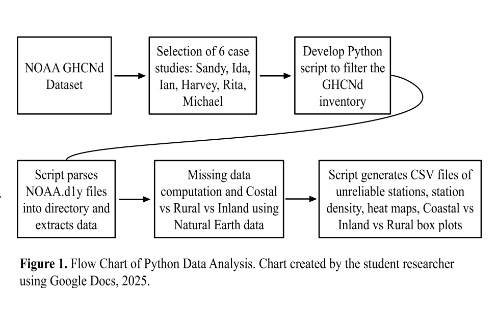

Daily precipitation data were obtained from the NOAA Global Historical Climatology Network Daily (GHCNd) archive [@noaa_ghcnd]. To compare weather-station performance during major extreme precipitation events, six hurricanes affecting the Northeastern United States, Southeastern United States, and the Gulf Coast were selected. These regions vary widely in precipitation intensity and infrastructure vulnerability, which made them suitable for repeated case-study analysis.

*Table 1. Major hurricanes analyzed in this study.*

| Case Study | Location/Region | Date Range | Geographic Coordinates |
|---|---|---|---|
| Hurricane Sandy | NY, NJ, CT, DE | 2012-10-25 to 2012-11-05 | Latitude: 39.5 to 42.5 Longitude: -75.5 to -72.0 |
| Hurricane Ida | Louisiana to Northeast | 2021-08-26 to 2021-09-05 | Latitude: 29.0 to 41.0 Longitude: -91.5 to -73.0 |
| Hurricane Ian | FL, GA, SC, NC | 2022-09-25 to 2022-10-05 | Latitude: 26.0 to 34.0 Longitude: -84.0 to -78.5 |
| Hurricane Harvey | TX, LA | 2017-08-23 to 2017-09-05 | Latitude: 27.0 to 31.5 Longitude: -96.5 to -91.0 |
| Hurricane Rita | FL, TX, LA | 2005-09-18 to 2005-09-26 | Latitude: 26 to 33.5 Longitude: -98.5 to -87 |
| Hurricane Michael | FL, GA, AL, NC, VA | 2018-10-02 to 2018-10-17 | Latitude: 29.0 to 33.0 Longitude: -86.5 to -83.0 |

Using Python (packages included `os`, `io`, `zipfile`, `requests`, `numpy`, `pandas`, `matplotlib`, `geopandas`, `seaborn`, and `scipy`), the GHCNd dataset was processed for each of the six hurricanes. Across all runs, two essential metadata files were used: `ghcnd-stations.txt` (station coordinates and metadata) and `ghcnd-inventory.txt` (variables and years available at each station). For every event, the script filtered stations by latitude/longitude boundaries, timeframe, and variable type (e.g., PRCP).

To standardize processing across hurricanes, a second automation script was created that loaded the predefined event boundaries in a two-dimensional array and reduced the chance of user input error. For each of the six hurricanes, this script generated three CSV files, resulting in 18 total CSV outputs across the study. These included:

1. `selected_stations.csv` — all stations located within the case study's location
2. `stations_with_missing_data.csv` — the number and percentage of missing or malfunctioning observations for each station
3. `missing_summary.csv` — day-level summaries of the number of functioning stations, malfunctioning stations, and the malfunctioning percentage

These files served as the basis for all tables, time-series plots, and visualizations. The script also produced bar plots comparing coastal, inland, and rural station performance before and during the hurricane, categorized using geopandas.

### 2.2 QGIS (Quantum Geographic Information System) Visualization

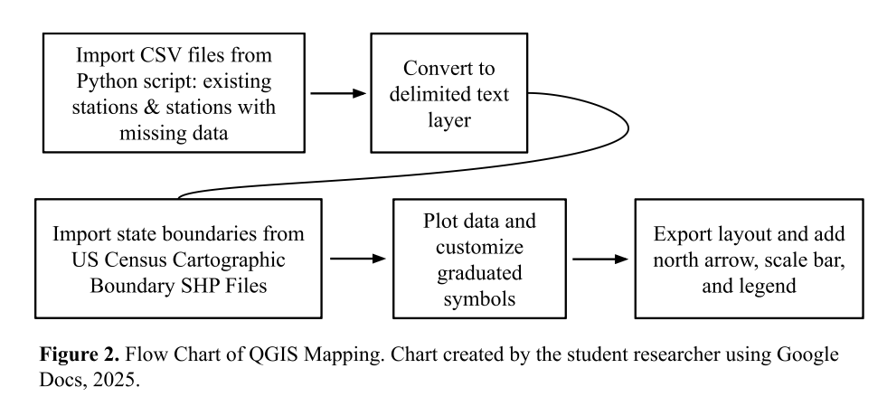

For each hurricane case study, two of the Python-generated CSV files (`selected_stations.csv` and `stations_with_missing_data.csv`) were imported into QGIS as delimited text layers. The selected-station layer displayed all active stations during the event as semi-transparent white circles. The malfunctioning-station layer was visualized using a graduated color scale ranging from light yellow to dark red to represent increasing percentages of missing data.
 
To provide geographic context, state boundary shapefiles were downloaded from the U.S. Census Bureau Cartographic Boundary Files [@census_boundary] and imported into QGIS as vector layers. This workflow was repeated for each hurricane to maintain consistency across visual outputs.
 
Each hurricane map was exported using QGIS's Print Layout tool, with a title, legend, scale bar, and north arrow. All maps were generated by the student researcher using QGIS and Canva (2025).

---

## Results

This study analyzed how reliably weather stations operate during extreme precipitation events, especially hurricanes. By measuring the amount of missing data before and during storms, it identified weaknesses in the climate monitoring network that could impact forecasting and emergency response.
 
Station density varied significantly across hurricane case studies. Hurricane Sandy occurred in the region with the densest network (0.006371 stations/km²), while Hurricane Rita occurred in the sparsest region (0.000870 stations/km²). These differences indicate that dense urban networks have greater redundancy, whereas low-density regions are more vulnerable to widespread data loss.

*Table 2. Station density (stations per km²) for selected hurricanes, showing the spatial coverage of weather stations during each case study.*

| Case Study | Station Density (stations/km²) |
|---|---|
| Hurricane Sandy | 0.006371 |
| Hurricane Ian | 0.003129 |
| Hurricane Harvey | 0.001575 |
| Hurricane Rita | 0.000870 |
| Hurricane Michael | 0.001860 |

During the months prior to Hurricane Sandy, missing data was scattered and relatively limited, with no major coastal outages, showing stable station performance (Figure 1a). Most missing data was likely caused by station maintenance or malfunctions unrelated to Hurricane Sandy. However, during the storm, missing data increased dramatically along the coastline and across New Jersey, forming concentrated clusters of outages in areas closest to landfall (Figure 1b). Despite increased unreliability in NYC, the region's high station density of 0.006371 stations/km² (Table 2) allowed overall coverage to remain relatively intact compared to more exposed coastal zones, such as Long Island. This demonstrates that stations near coastlines and within a hurricane's landfall zone are most vulnerable to failure [@nws_wea].
 
The time-series plot shows missing data rising from a baseline of ~10% to 30% at peak impact, followed by a partial recovery to around 20%, indicating that some stations were not repaired even after landfall (Figure 1c). Boxplots comparing geographic categories show that coastal, inland, and rural stations performed similarly before the storm (Figure 1d), but diverged dramatically during it. Coastal stations exhibited the highest levels of missing data, with some nearing complete data loss, while inland and rural stations showed little to no increase (Figure 1e). Dense urban networks, such as New York City, retained overall coverage despite some failures, showing how differences in network structure, rather than station quality, drive regional differences in weather station reliability.
 
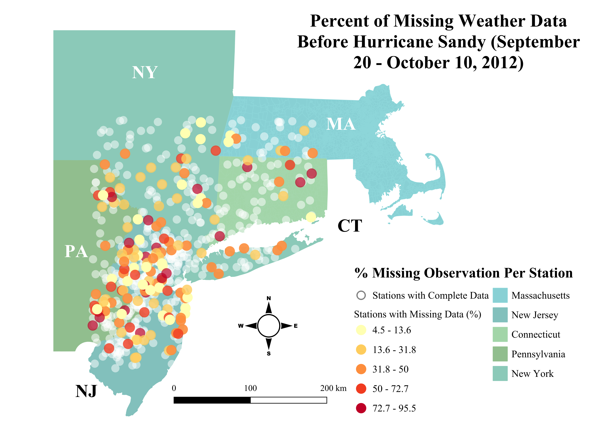
 
**Figure 1a.** Before Hurricane Sandy (2012). Missing data are present across the network, but the spatial pattern is far less pronounced than during the storm period. Most gaps appear clustered around urban areas, particularly New York City. There are no major clusters of extreme data loss along the coastline.
 
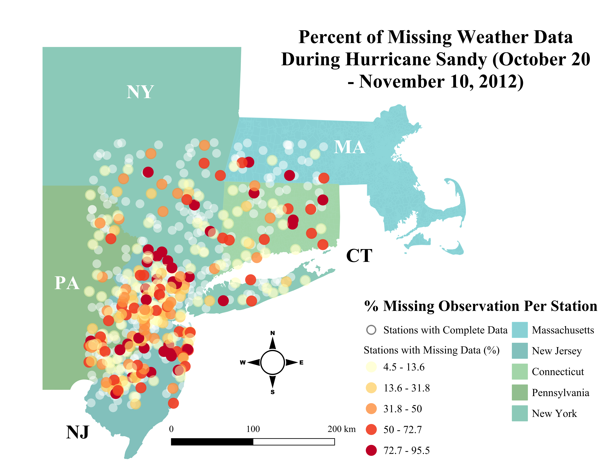
 
**Figure 1b.** During Hurricane Sandy (2012). During the storm, the most substantial data gaps occurred along the coastline and across several regions of New Jersey. New York City also exhibited notable increases in missing data.
 
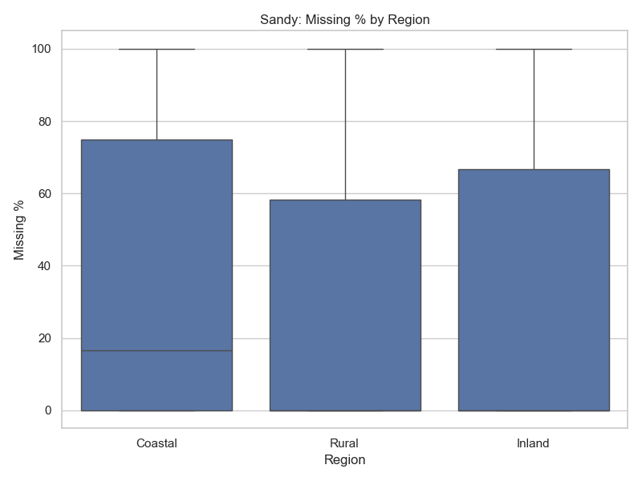
 
**Figure 1c.** Boxplot of Mean Missing Data Before Hurricane Sandy (2012). Coastal, rural, and inland stations exhibit broadly similar levels of missing observations, generally falling within the 60–76 range. Coastal stations show slightly higher missing data overall, but the differences across the three geographic categories are modest.
 
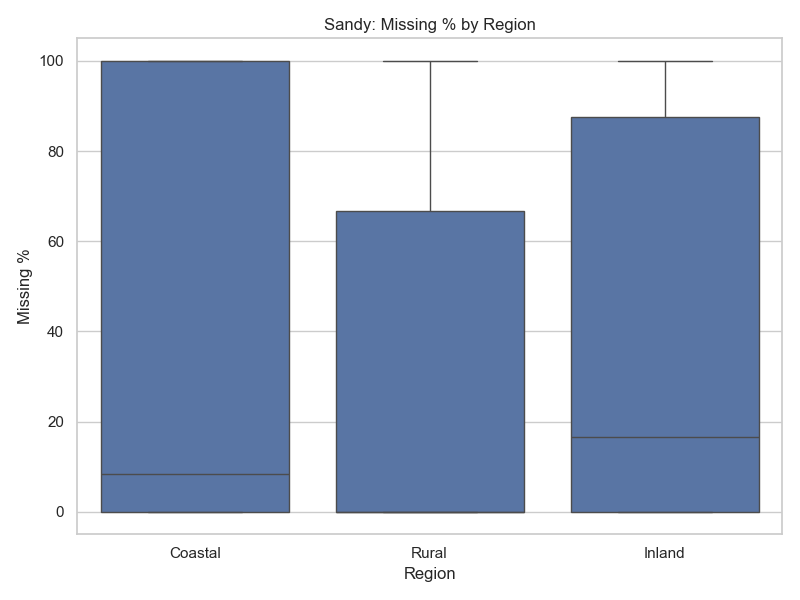
 
**Figure 1d.** Boxplot of Mean Missing Data During Hurricane Sandy (2012). Missing data increased dramatically in coastal areas, with some stations reaching nearly 100% data loss. Inland stations also experienced elevated missing data, though to a lesser extent, peaking around 80%. In contrast, rural areas show minimal change.
 
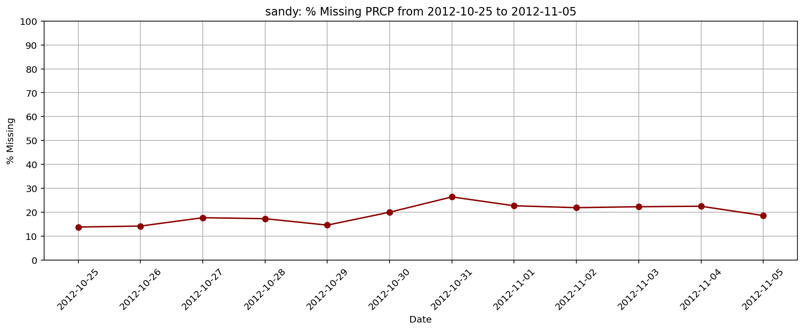
 
**Figure 1e.** Time-series graph of Mean Missing Data During Hurricane Sandy (2012). The time series shows a baseline of approximately 10% missing data. As Sandy hit landfall, the percentage of missing observations climbed sharply, peaking near 30% on October 31. Following landfall, the proportion of missing data stabilizes around 20%.
 
### 3.2 Case Study: Hurricane Ian
 
During the months prior to Hurricane Ian, missing data was concentrated in Tampa Bay and southeastern Florida, including Miami and other major coastal urban centers (Figure 2a). These gaps were most pronounced along the coastline, reflecting limitations in station coverage in densely populated areas. During the storm, missing data increased significantly along the east coast and Tampa Bay, with coastal and rural regions experiencing the largest increases; coastal stations reached around 80% missing data, while inland stations increased by only about 10% (Figures 2b, 2d). This pattern aligns with the hurricane's path and the regional station density, which for Hurricane Ian was 0.003129 stations/km² (Table 2), lower than that of Hurricane Sandy. The time-series plot shows no notable overall increase in missing data (Figure 2e), suggesting that despite localized failures, the network maintained stable reporting in most areas. This may be because the hurricane's impacts were concentrated in a relatively small portion of the study area, limiting widespread disruption to the broader observation network. These results indicate that stations near the storm's landfall and in low-density rural regions are most vulnerable to data loss, while inland networks retain more consistent reporting.
 
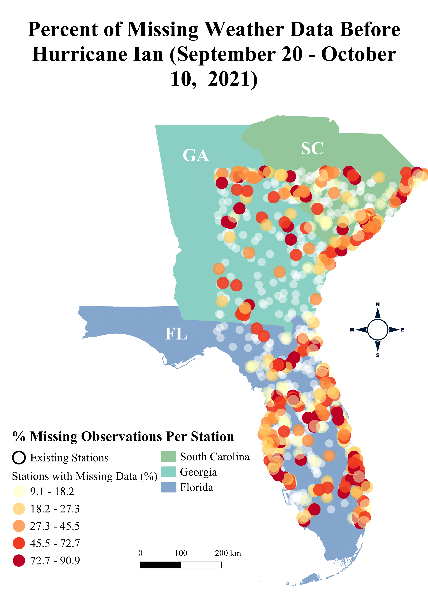
 
**Figure 2a.** Before Hurricane Ian (2021). Missing data are concentrated in areas central to Tampa Bay and southeastern Florida. These gaps are particularly notable along the coastline.
 
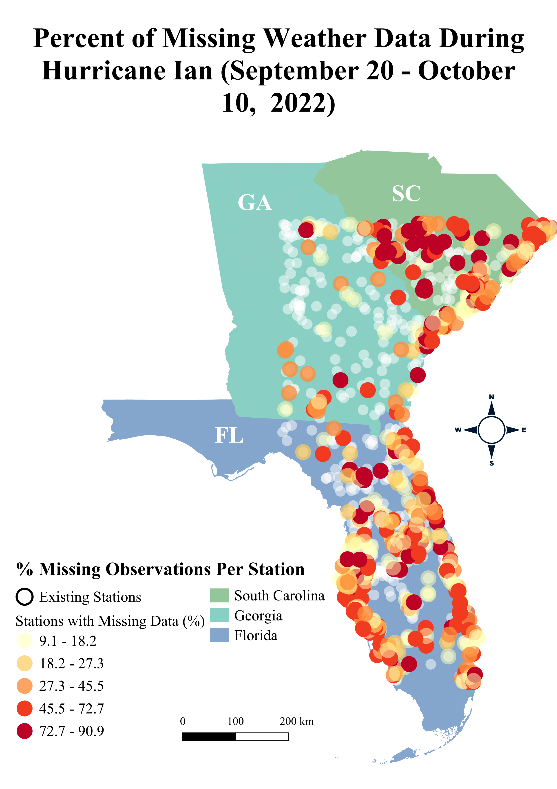
 
**Figure 2b.** During Hurricane Ian (2022). Missing data increased significantly during the storm. A distinct pattern appears along the east coast and Tampa Bay. Southern Florida shows relatively less missing data, while inland areas further north, including parts of South Carolina, experience substantial gaps.
 
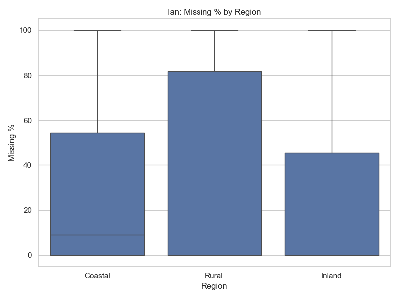
 
**Figure 2c.** Boxplot of Mean Missing Data Before Hurricane Ian (2021). Rural regions exhibit the highest proportion of missing data, around 80%. Coastal and inland areas show lower missing percentages, typically ranging from 40–60%.
 
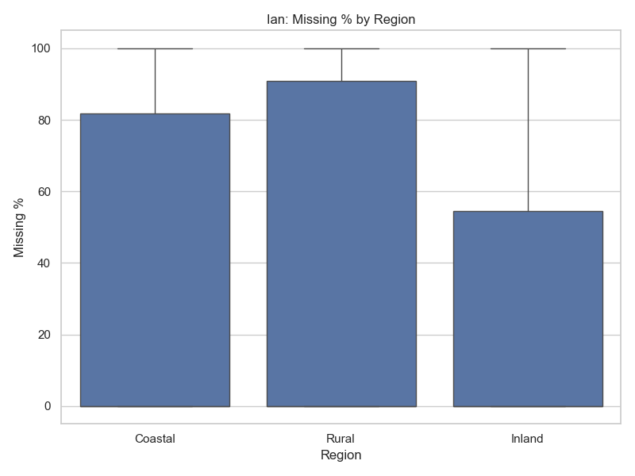
**Figure 2d.** Boxplot of Mean Missing Data During Hurricane Ian (2022). Coastal and rural regions experienced the largest increases in missing data, with coastal stations reaching around 80% and inland stations increasing by only about 10%.
 
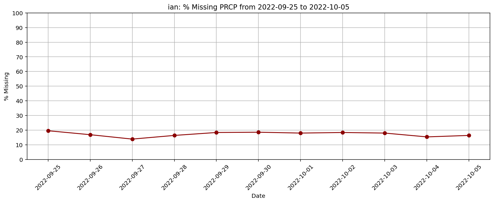
 
**Figure 2e.** Time-series graph of Mean Missing Data During Hurricane Ian (2012). No notable increase in missing observations is observed throughout the storm, with no significant rise in missing observations during the storm.
 
### 3.3 Case Study: Hurricane Harvey
 
During the months prior to Hurricane Harvey, missing data was scattered outside the Houston metropolitan area, with no clear pattern, while coverage within Houston was more complete due to high station density (Figure 3a). Most missing data was likely caused by maintenance or minor malfunctions unrelated to the hurricane. During the storm, missing data increased in Houston and nearby coastal areas, forming a cluster of outages near the region of landfall, which aligns with Hurricane Harvey's landfall along the Texas coast [@nws_harvey]. Nevertheless, inland and rural regions remained relatively stable (Figure 3c). With a station density of only 0.001575 stations/km² (Table 2), the network had limited redundancy, making coastal stations particularly vulnerable to failure, while denser urban areas retained better overall coverage.
 
The time-series plot shows that mean missing data stayed mostly consistent around 20–30%, with a dip to 10% on August 29, indicating only minor malfunctions during the storm (Figure 3e). Boxplots comparing geographic categories show that coastal, inland, and rural stations had similar levels of missing data before the storm (Figure 3c). However, during landfall, coastal stations showed the highest amounts of missing data, reflecting the storm's impact, while inland and rural stations showed minimal increases.
 
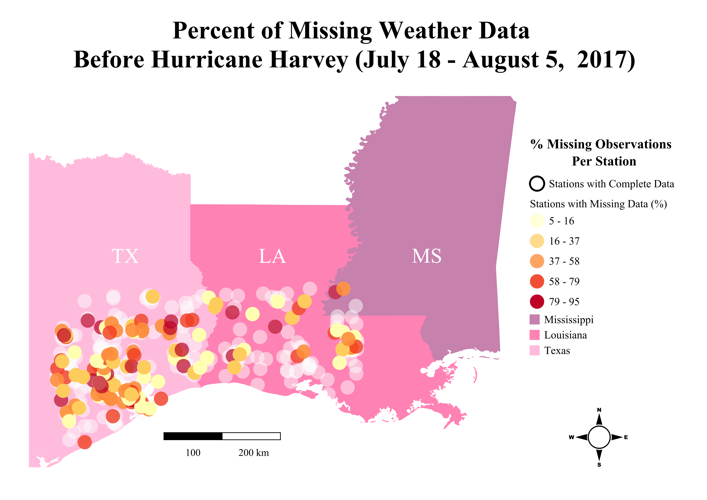
 
**Figure 3a.** Before Hurricane Harvey (2017). Most missing observations outside the Houston metropolitan area are scattered irregularly with no discernible spatial pattern. Within Houston, data coverage is more complete.
 
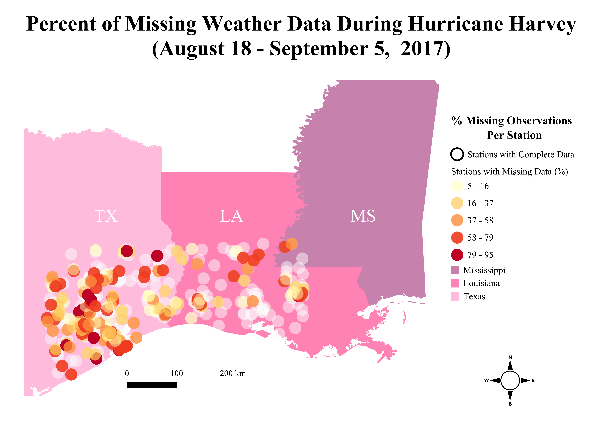
 
**Figure 3b.** During Hurricane Harvey (2017). Missing observations within the Houston metropolitan area increase noticeably. Outside of Houston, the spatial distribution of missing data remains largely similar to pre-storm conditions.
 
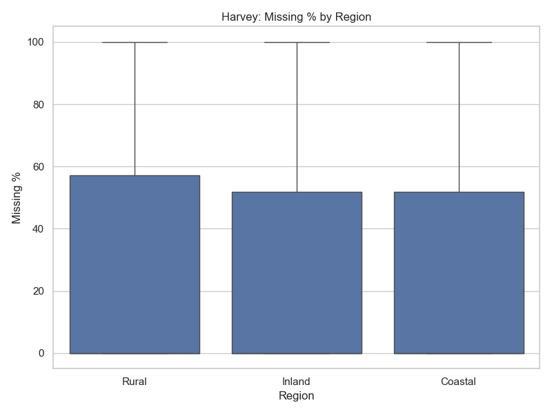
 
**Figure 3c.** Boxplot of Mean Missing Data Before Hurricane Harvey (2017). Average missing data is similar across rural, inland, and coastal stations, ranging roughly between 50–60%.
 
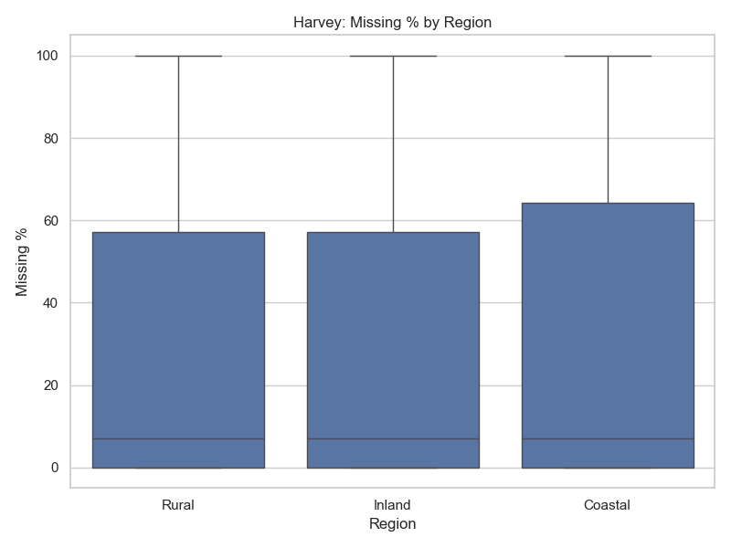
 
**Figure 3d.** Boxplot of Mean Missing Data during Hurricane Harvey (2017). Average missing data in rural and inland regions remains similar to pre-storm values, while missing data in coastal areas increases noticeably.
 
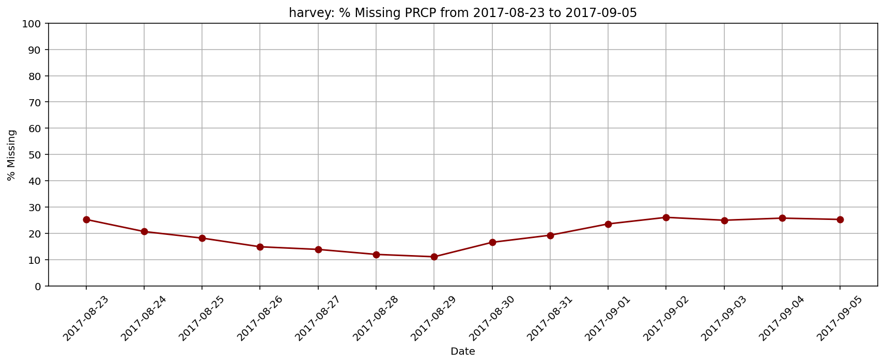
 
**Figure 3e.** Time-series graph of Mean Missing Data During Hurricane Harvey (2017). The mean missing data stayed mostly consistent around 20% to 30%, but dipped on 2017/08/29 to 10%.
 
### 3.4 Case Study: Hurricane Rita
 
During the months prior to Hurricane Rita, missing data was scattered with no significant pattern, as most stations reported nearly complete observations (Figure 4a, 4c). During the storm, missing data increased along the coasts of Louisiana and Texas, forming clusters of outages in regions directly impacted by landfall (Figure 4b, 4d). Inland stations experienced smaller increases in missing data, remaining more reliable. With a low station density of 0.000870 stations/km² (Table 2), the network had limited redundancy, making coastal stations particularly vulnerable to failure, while inland areas were less affected.
 
The time-series plot shows missing data rising sharply from a baseline of 0% to around 45% on September 20, aligning with Hurricane Rita's landfall, before decreasing to 10% on September 26 (Figure 4e; [@nws_rita]). Coastal stations experienced the highest missing data during the storm, while inland stations showed only minor increases. This highlights how low-density coastal networks are especially susceptible to disruptions during hurricanes, whereas inland stations maintain more consistent reporting.
 
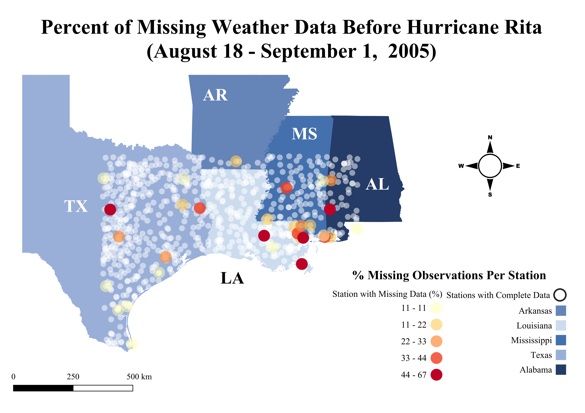
 
**Figure 4a.** Before Hurricane Rita (2005). Missing values are scattered, no significant pattern.
 
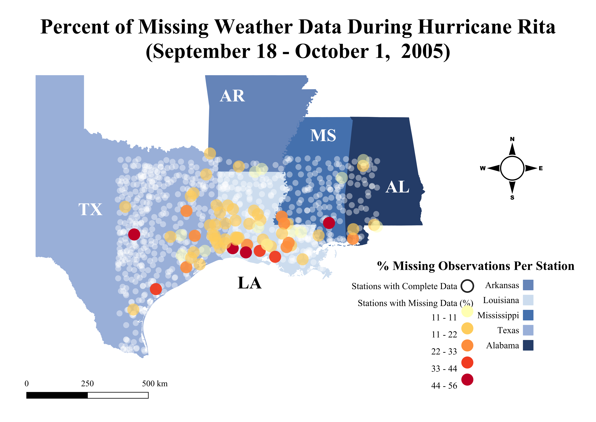
 
**Figure 4b.** During Hurricane Rita (2005). Missing values are concentrated along the coasts of Louisiana and Texas.
 
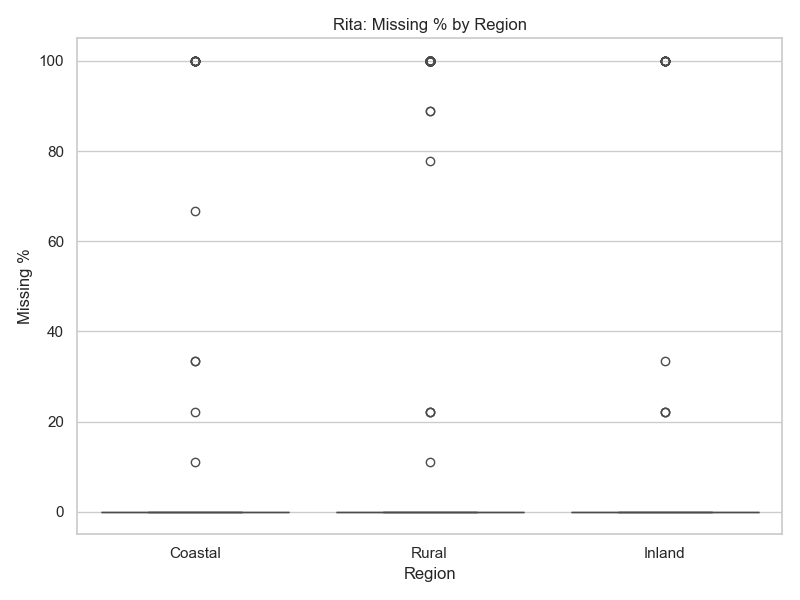
 
**Figure 4c.** Boxplot of Mean Missing Data Before Hurricane Rita (2005). Most stations report nearly complete data, with mean missing values close to zero. Only a few stations show small amounts of missing data, reflected as individual points outside the main distribution.
 
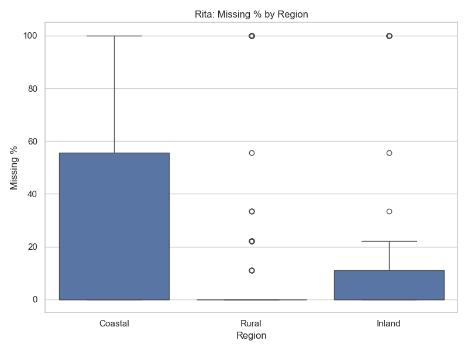
 
**Figure 4d.** Boxplot of Mean Missing Data During Hurricane Rita (2005). Missing data increased markedly along the coast, reaching approximately 55%, while inland stations experienced a smaller increase to around 10%. This pattern aligns closely with the hurricane's landfall.
 
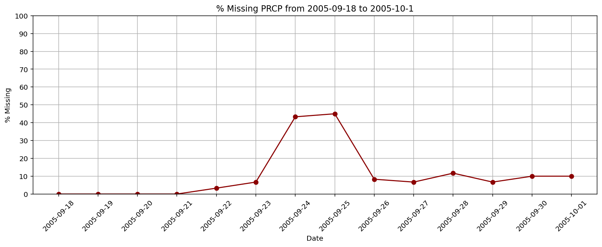
 
**Figure 4e.** Time-series graph of Mean Missing Data During Hurricane Rita (2005). Starting from a baseline near 0%, missing data rapidly increased to approximately 45% on September 23, 2005. By September 26, missing data declined to around 10%, but never returned fully to 0%.
 
### 3.5 Case Study: Hurricane Michael
 
During the months prior to Hurricane Michael, missing data was scattered with no spatial pattern, though some clusters appeared along the coast and in some inland areas (Figure 5a, 5c). Rural stations showed the highest mean missing-data rates, averaging around 80%, while inland stations were around 74%, and coastal stations had the lowest rates, below 60%. During the hurricane, missing data increased sharply along the coast and inland, with coastal and inland stations reaching nearly 100% missing data, while rural stations remained largely unchanged (Figure 5b, 5d). With a station density of 0.001860 stations/km² (Table 2), the network had limited redundancy, making both coastal and inland stations vulnerable to failure, while rural areas maintained their reporting.
 
The time-series plot shows the mean missing data rising from 10–20% to more than 30% during the hurricane, before returning to normal levels post-storm (Figure 5e). Coastal and inland stations experienced the largest increases in missing data during the storm, while rural stations remained stable. This highlights how both proximity to the storm and network density influence regional differences in weather station reliability.
 
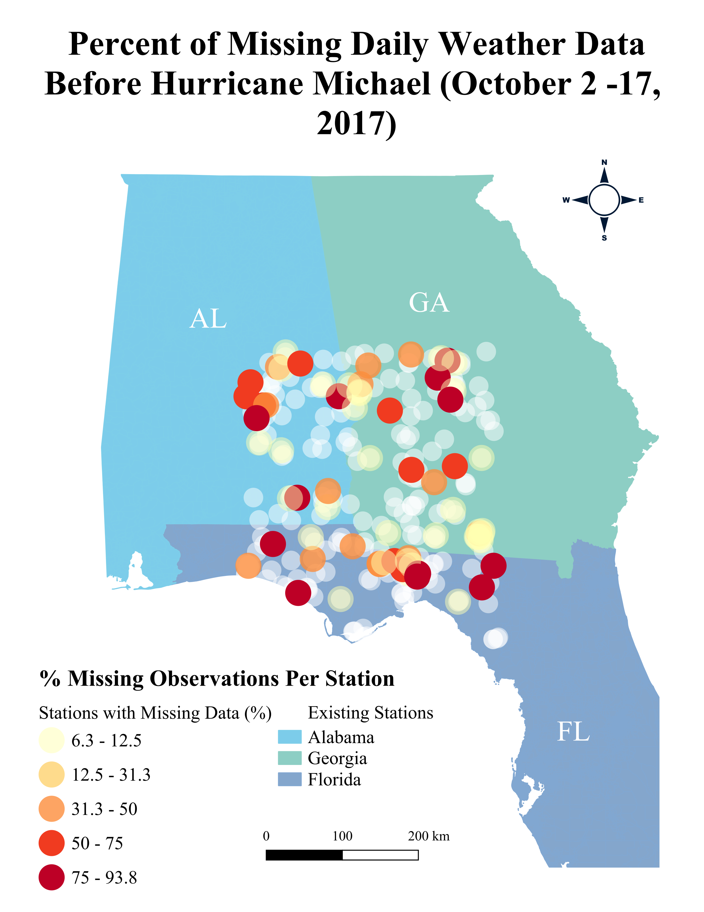
 
**Figure 5a.** Before Hurricane Michael (2017). Missing data are mostly dispersed without a strong spatial pattern. However, a few modest clusters of missing values emerge along the coast, while smaller clusters appear inland.
 
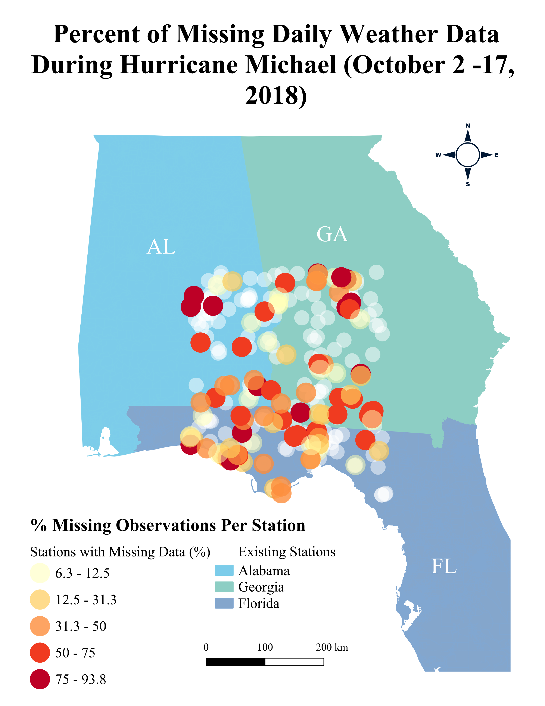
 
**Figure 5b.** During Hurricane Michael (2018). The coastal–rural cluster remains visible, but the density of missing observations along the coast increases sharply. Inland stations show relatively little change, with missing data levels similar to those observed prior to the storm.
 
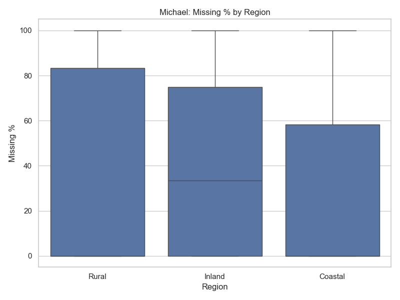
 
**Figure 5c.** Boxplot of Mean Missing Data Before Hurricane Michael (2017). Rural stations show the highest mean missing-data rates, averaging around 80%. Inland stations exhibit similarly elevated levels at roughly 74%. Coastal stations have the lowest missing-data rates, remaining below 60%.
 
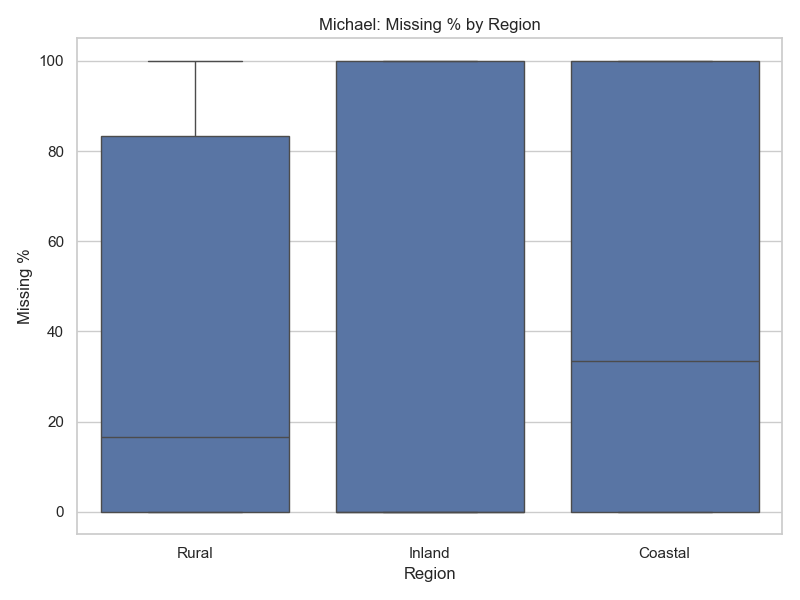
 
**Figure 5d.** Boxplot of Mean Missing Data During Hurricane Michael (2018). Rural stations remain largely unchanged, with mean missing-data rates near 80%. In contrast, both inland and coastal stations experience a sharp increase, with missing-data levels rising to nearly 100%.
 
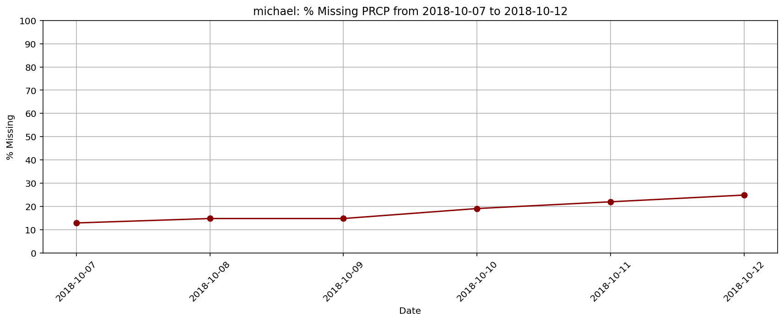
 
**Figure 5e.** Time-series graph of Mean Missing Data During Hurricane Michael (2018). The mean percentage of missing data increases sharply during the hurricane, rising from a baseline of roughly 10–20% to more than 30%, before returning to normal post-storm levels.
 
---
 
## Discussion
 
These findings have important implications for climate science and emergency management. Missing weather-station data compromises the accuracy of climate models, flood forecasting, and estimates of storm severity and frequency [@alejosanchez2025; @hoss2018]. Although remote sensing and weather balloons provide supplemental information, they cannot fully replace continuous ground-based observations [@gao2014; @auffhammer2013]. For first responders, the absence of reliable real-time data limits the ability to issue evacuation notices, target rescue operations, or assess which regions are still in critical condition, putting lives and property at risk [@nws_wea; @hoss2018]. With climate change increasing the frequency and severity of extreme events, resilient station networks become even more essential.
 
The contrast between New York City's robust data coverage and the more frequent gaps observed in rural Gulf Coast regions underscores a broader infrastructure disparity. Urban areas often receive more maintenance, funding, and technological upgrades, while rural stations may face longer outages due to fewer resources and decreased prioritization. Globally, many of the regions most vulnerable to hurricanes and heavy rainfall lack the monitoring infrastructure needed to support effective planning and response [@otto2023].
 
Several sources of error may have influenced the results. Uneven station density can exaggerate regional differences, and variations in station age, maintenance schedules, or technical issues could cause missing data unrelated to the hurricane. Data reporting delays or human error may also appear as missing values, and the temporal sampling windows may not fully capture the progression of outages before or after landfall. Additionally, this study does not investigate the specific causes of missing data; outages may result from hurricane-related damage or from unrelated technical or transmission failures. Future research could cross-reference sensor diagnostics and station logs to determine the exact causes of missing data.
 
The study also focused only on U.S. hurricanes, limiting the geographic scope, and only precipitation data from weather stations was analyzed, leaving other variables such as temperature or snow depth unexplored. Each variable uses different sensors, so missing data patterns may differ. While Hurricane Ida was initially considered due to its large and widespread land impacts, it was ultimately excluded because QGIS could not reliably visualize the affected station coverage for this event within the project's constraints. Finally, while this study only addressed U.S. stations, GHCNd is a global network, allowing for future international comparisons.
 
---
 
## Conclusion
 
The evaluation of missing data in GHCNd weather stations during major hurricanes shows that extreme precipitation events cause substantial disruptions to climate monitoring systems. Stations located near coastlines and within the storm's core frequently experience the highest levels of malfunctioning, with some stations during Hurricane Harvey reporting over 90% missing data. Spatial maps reinforce this pattern, revealing concentrated clusters of outages in landfall zones and flood-prone coastal regions. The results indicate that storm intensity, coastal proximity, and regional network density strongly influence weather station reliability.
 
While both urban and rural regions may show similar percentages of failed stations, the impact differs: dense urban networks, such as those in New York City during Hurricane Sandy, maintain overall coverage despite some failures, whereas sparse rural networks, such as in East Texas and parts of the Gulf Coast, develop large spatial blind spots when even a few stations go down. This suggests that differences in network coverage, rather than station quality, drive the observed patterns of missing data, supporting the study's objective of understanding how reliability varies across regions and storm intensities.
 
The patterns of missing data observed during hurricanes suggest clear avenues for practical application and future study. Stations with historically high percentages of missing values can be prioritized for maintenance and resilience upgrades, improving reliability during severe events. Enhancing durability and increasing servicing frequency will allow for more accurate early warning systems and efficient emergency response. These improvements are critical for adaptation to a changing climate, as they reduce blind spots in monitoring, enable timely interventions, and ultimately protect both lives and property. Expanding research to include additional types of extreme weather, such as tornadoes or floods, could further identify vulnerabilities and help optimize station networks for better coverage in both urban and rural areas.
 
# Acknowledgements

 I would like to thank all the support from Dr. Shakila Merchant, Cesar Ortiz, and, my mentor, Dr. Nir Krakauer. I would also like to thank Yuneeb Awan making this experience so enjoyable.
 
# References
